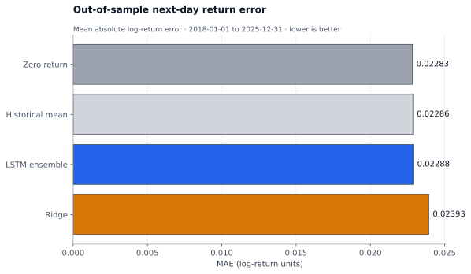
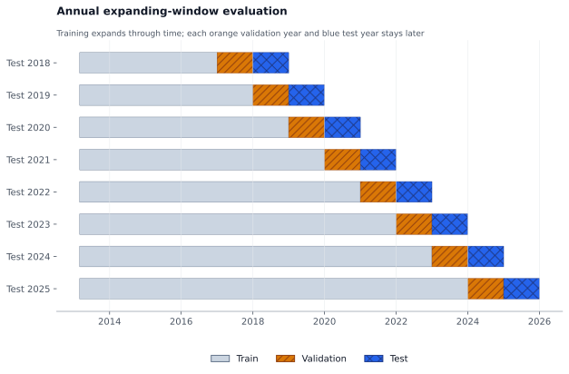

# LSTM Bitcoin Research

[](https://github.com/Z-MarkUs/LSTM-Bitcoin/actions/workflows/ci.yml)
[](https://github.com/Z-MarkUs/LSTM-Bitcoin/actions/workflows/codeql.yml)
[](pyproject.toml)
[](LICENSE)
[](DATA_LICENSE.md)

An honest rebuild of a leakage-prone course project into a reproducible Bitcoin
time-series benchmark. It asks one deliberately narrow question: **does a compact
LSTM improve next-day return forecasts over simple baselines when every decision is
made in chronological order?**

> **Finding:** no demonstrated improvement. Across 2,922 unique out-of-sample days
> from 2018 through 2025, the three-seed LSTM ensemble had MAE **0.022885** versus
> **0.022832** for the zero-return baseline. The 95% moving-block bootstrap interval
> for the MAE difference was **[-0.000064, 0.000160]**, which includes zero.

Reporting the negative result is intentional portfolio evidence: the project makes
the baseline, leakage controls, uncertainty, data rights, and reproducibility more
important than a flattering headline.



## Results at a glance

The primary metric is mean absolute error in next-day log-return units; lower is
better. All values below come from the checksum-verified
[reference run](evaluation/results/reference-v1/metrics.json), not hand-edited prose.

| Model | OOS MAE | OOS RMSE | MAE / zero baseline |
| --- | ---: | ---: | ---: |
| Zero return | **0.022832** | **0.034564** | **1.0000** |
| Historical mean | 0.022861 | 0.034622 | 1.0012 |
| LSTM ensemble | 0.022885 | 0.034609 | 1.0023 |
| Ridge | 0.023934 | 0.035298 | 1.0482 |

The separately reported 2025 test fold tells the same story: LSTM MAE was
**0.015816**, while the zero-return baseline reached **0.015793**. The signal simulation is secondary,
idealized, and explicitly not a claim of tradable profitability; read its assumptions
before interpreting the [equity view](docs/assets/signal_equity.svg).

## What makes the evaluation defensible

- **Past-only inputs.** Five price-derived features use data available no later than
  the forecast origin. Prediction accepts features only—never a future target or
  decoder seed.
- **Walk-forward testing.** Eight expanding folds use earlier training data, a later
  calendar validation year, and one still-later test year. Every 2018–2025 test date
  appears exactly once.
- **Real baselines.** Zero return, historical mean, and ridge regression face the same
  dates and features as the LSTM.
- **Train-only fitting.** LSTM feature and target scalers fit only the training block;
  the validation year controls early stopping and the outer test year remains unseen.
- **Seed visibility.** Seeds 7, 17, and 29 are retained separately, then averaged.
  Their predictions, metrics, and training traces are checked in for review.
- **Quantified uncertainty.** A fixed 2,000-resample, 30-day moving-block bootstrap
  accompanies the LSTM-versus-best-baseline MAE difference.
- **Explicit execution assumptions.** The optional long/flat simulation forms a
  position at the origin, applies it only to the next return, charges one-way turnover
  costs, and publishes 0–50 bps sensitivity.



The complete protocol is in [docs/methodology.md](docs/methodology.md), with design
boundaries in [docs/architecture.md](docs/architecture.md) and caveats in
[docs/limitations.md](docs/limitations.md).

## Reproduce it

The repository supports Python 3.11 and 3.12; Python 3.12 is the reference
environment. Install [uv](https://docs.astral.sh/uv/), then run:

```bash
uv sync --locked --all-extras --python 3.12
uv run --frozen lstm-bitcoin data validate
uv run --frozen lstm-bitcoin verify \
  --run evaluation/results/reference-v1
```

To rerun the full study without overwriting the reviewed evidence:

```bash
uv run --frozen lstm-bitcoin reproduce \
  --config configs/reference.toml \
  --output evaluation/runs/reference-v1 \
  --plots evaluation/runs/reference-v1-plots
uv run --frozen lstm-bitcoin verify \
  --run evaluation/runs/reference-v1
```

The tracked two-column data snapshot can also be rebuilt from the exact upstream
[Coin Metrics](https://github.com/coinmetrics/data) commit and raw SHA-256 with
`lstm-bitcoin data fetch --force`. See
[docs/reproducibility.md](docs/reproducibility.md) for the clean-room workflow and
expected variation across platforms.

## Evidence map

| Path | What a reviewer can inspect |
| --- | --- |
| [`src/lstm_bitcoin`](src/lstm_bitcoin) | Typed data, feature, split, model, metric, simulation, and artifact modules |
| [`tests`](tests) | Offline synthetic tests for leakage boundaries, determinism, chronology, provenance, failure paths, and the full pipeline |
| [`configs/reference.toml`](configs/reference.toml) | Frozen folds, costs, seeds, and model settings |
| [`data/source-manifest.json`](data/source-manifest.json) | Provider, immutable revision, raw and processed hashes, transformation, rows, and dates |
| [`evaluation/results/reference-v1`](evaluation/results/reference-v1) | Predictions, folds, per-seed evidence, metrics, simulation rows, manifest, and SHA-256 list |
| [`notebooks/reference_evaluation.ipynb`](notebooks/reference_evaluation.ipynb) | Executed, read-only walkthrough of the checked artifacts; it does not retrain |
| [`docs`](docs) | Architecture, methodology, provenance, reproducibility, limitations, and legacy audit |

The CLI exposes six reviewable workflows:

```text
lstm-bitcoin data fetch      # retrieve only the pinned, allowlisted source
lstm-bitcoin data validate   # verify schema, dates, prices, and provenance
lstm-bitcoin evaluate        # run the chronological forecast benchmark
lstm-bitcoin report          # generate deterministic SVG evidence
lstm-bitcoin verify          # require and hash-check the complete result bundle
lstm-bitcoin reproduce       # validate, evaluate, plot, and verify end to end
```

## Why this repository was rebuilt

The 2021 coursework version contained target leakage, future-aware trading logic,
contradictory performance prose, a failed interpretation section, unclear data/code
provenance, and large serialized models. Those files and claims are excluded from the
maintained branch and new releases.

The audit is preserved in [docs/legacy-coursework.md](docs/legacy-coursework.md). The
defensible project story is not “an LSTM predicted Bitcoin.” It is: **I found that the
old experiment could not support its claims, then rebuilt it so the evidence could
disagree with the model.**

## License and intended use

New code and documentation are MIT-licensed. The Coin Metrics subset and derived
artifacts remain subject to **CC BY-NC 4.0**; [DATA_LICENSE.md](DATA_LICENSE.md)
documents the exact boundary and attribution. This repository is research and
engineering evidence—not investment advice, a live signal, or a production trading
system.
